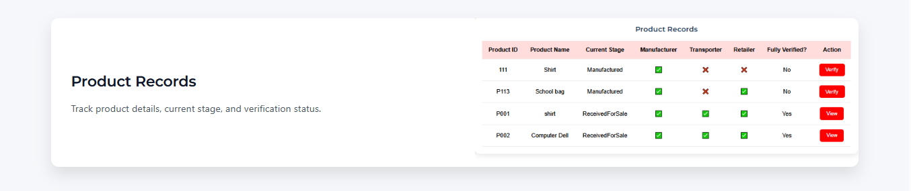

# Decentralized Supply Chain Tracker

A blockchain-based platform to track the entire supply chain from manufacturer to retailer. This project ensures **transparency, verification, and accountability** at each stage using Ethereum smart contracts.

---
## Demo

## 🚀 Project Overview

The Decentralized Supply Chain Tracker allows:

- Manufacturers to add products and register roles.
- Transporters to update the status during transit.
- Retailers to confirm receipt of products.
- Verification of products by all participants to ensure authenticity.

The platform integrates **React.js frontend, Node.js backend, MongoDB**, and **Solidity smart contracts** for blockchain tracking.

---

## 📂 Folder Structure

- `frontend/` : React.js web application (UI for manufacturer, transporter, retailer)
- `backend/`  : Node.js + Express API (handles requests from frontend)
- `blockchain/` : Solidity smart contracts for supply chain management

---

## 🛠 Features

- Add new product with manufacturer, transporter, and retailer roles.
- Update product status at every stage: Manufactured → In Transit → Received for Sale.
- Track product history and verify roles for authenticity.
- Summary dashboards for Manufacturer, Transporter, and Retailer.
- Full decentralized verification using blockchain.

---

## 💻 Technologies Used

- **Frontend:** React.js, Tailwind CSS, React Router
- **Backend:** Node.js, Express.js, REST API
- **Database:** MongoDB
- **Blockchain:** Solidity, Hardhat, Truffle, Ethereum, MetaMask
- **Other Tools:** Git, GitHub, VS Code, React Icons, React Toastify

---

## ⚡ Smart Contract Details

The `SupplyChain.sol` contract includes:

- **Enums & Structs:** Stage, StatusUpdate, RoleAddresses, Product
- **Mappings:** products, productHistory, productVerifiedRoles, approvals
- **Events:** ProductAdded, StatusUpdated, ProductVerified
- **Functions:**
  - `registerAsManufacturer() / registerAsTransporter() / registerAsRetailer()`
  - `addProduct()` – Add a new product
  - `updateStatus()` – Update product during transit
  - `markReceived()` – Retailer confirms receipt
  - `verifyProduct()` – Role verification
  - `getProductHistory()` – Fetch history of product
  - `getVerifiedRoles()` – Fetch addresses that verified
  - `getProductCount()` – Total products

---

## Installation

1. Clone repository:
   git clone https://github.com/DevSaloni/supplychain.git
2. Install dependencies for frontend and backend:
   cd frontend && npm install
   cd backend && npm install
3. Run locally:
   - Backend: node server.js
   - Frontend: npm start
